# Fluxograma do Processo de Fretes

```mermaid
flowchart TD

A[Marketing gera lead] --> B[Comercial contacta cliente]
B --> C[Comercial gera proposta / tabela de preços - ESL]
C --> D{Cliente dá o aceite?}

D -- Não --> B
D -- Sim --> E[Comercial abre ordem de coleta]

E --> F[Compras Fretes procura carro no estoque Loog IA]
F --> G{Achou carro no estoque?}

G -- Sim --> H[Negocia preço com interessados]
H --> I[Agregado é anexado à ordem de coleta no ESL]

G -- Não --> J[Procura carro no Fretebras ou grupos externos]
J --> K{Conseguiu carro?}

K -- Não --> L[Marketing gera campanha regional - tráfego pago]
L --> M[Marketing gera leads de agregados]
M --> N[Leads enviados para Compras Fretes]
N --> O[Compras Fretes cadastra agregado no ESL]
O --> P[GRIS valida agregado via ESL]
P --> Q[Agregado validado entra no banco Loog IA + grupos]
Q --> R[Banco de dados de carros cresce]
R --> I

K -- Sim --> H

I --> S[Pagamento 70% antecipado via CIOT]
S --> T[Agregado recebe instruções de coleta]

T --> U[Emissão CTE / Manifesto MDF se houver + GRIS]
U --> V[Agregado faz coleta no cliente]
V --> W[Tracking acompanha carga]
W --> X[Agregado faz entrega e gera comprovante - Easydoc]

X --> Y[Controladoria valida comprovante]
Y --> Z[Pagamento dos 30% do saldo via CIOT]

Z --> AA[CTE / Manifesto fechado no ESL]
AA --> AB[Agregado retorna ao estoque Loog IA]

AB --> AC[Financeiro aguarda fechamento do ciclo]
AC --> AD[Faturamento + boleto gerado]
AD --> AE[Financeiro envia arquivo banco + cliente]
AE --> AF[Financeiro envia pré-alerta de vencimento]

AF --> AG{Cliente pagou no vencimento?}

AG -- Sim --> AH[Banco valida recebimento]
AH --> AI[Financeiro faz baixa e conciliação]
AI --> AJ[Informações enviadas para contabilidade]
AJ --> AK[Cliente liberado no ESL para novos fretes]

AG -- Não --> AL[Início do processo de cobrança]
AL --> AM[Cliente paga com juros e multa]
AM --> AH
```

---

## Como visualizar o fluxograma

### Opção 1: GitHub / GitLab
Basta fazer upload do arquivo para o GitHub ou GitLab - eles renderizam Mermaid automaticamente.

### Opção 2: VS Code
Instale a extensão **"Markdown Preview Mermaid Support"** e use `Ctrl+Shift+V` para visualizar.

### Opção 3: Online
Copie o código Mermaid (entre os \`\`\`mermaid) e cole em:
- https://mermaid.live/
